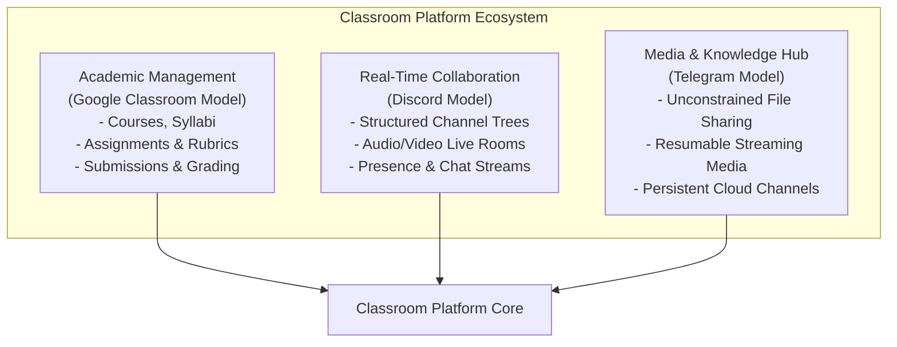
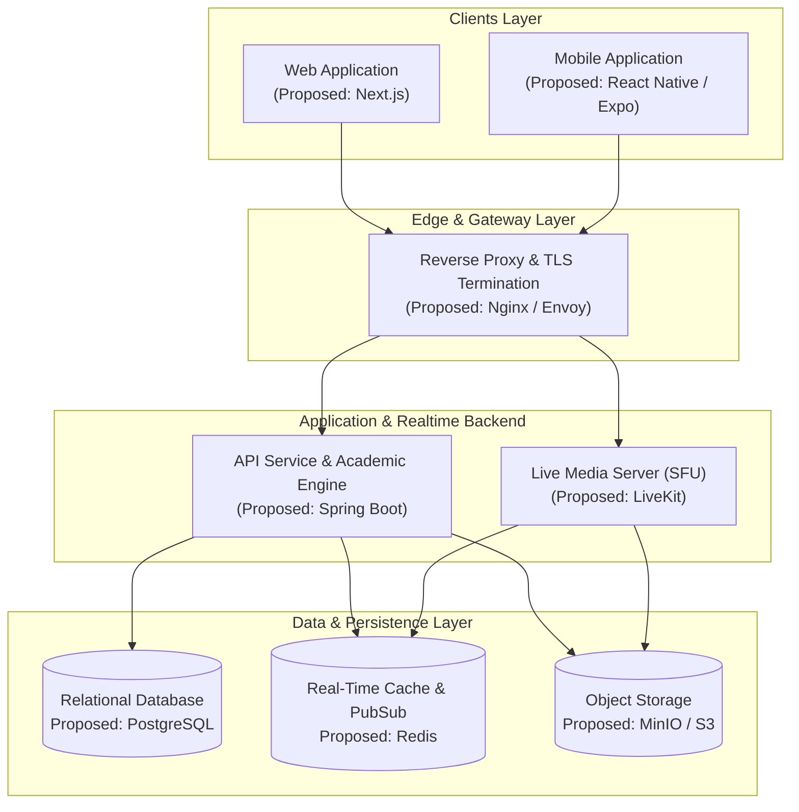

# Classroom Platform

> A unified, production-grade academic and collaborative communication platform combining Google Classroom's academic workflows, Discord's rich real-time community channels and live rooms, and Telegram's high-efficiency media and file distribution.

---

## 1. Project Overview

**Classroom Platform** is designed to bridge the gap between structured academic learning management systems (LMS) and modern, fluid, real-time collaboration platforms. Traditional learning management tools often isolate coursework from spontaneous student-teacher interactions, while modern chat applications lack native grading, rubric evaluation, and institutional governance.

Classroom Platform unifies these paradigms into a coherent ecosystem designed for web, mobile, cloud deployments, and self-hosted on-premises installations.



---

## 2. Product Vision

The platform empowers educational institutions, enterprise training academies, independent tutors, and student communities to:

1. **Eliminate Context Switching**: Seamlessly navigate between homework submissions, real-time channel chats, and live video breakout rooms without changing platforms.
2. **Promote Academic Transparency**: Provide explicit audit trails for grades, assignment revisions, attendance, and administrative oversight.
3. **Scale Across Infrastructure Models**: Run identically on managed cloud infrastructure or self-contained air-gapped institutional servers.
4. **Deliver Low-Latency Communication**: Provide instant messaging, collaborative document attachments, and interactive WebRTC live streams under constrained network conditions.

---

## 3. Core Capabilities & Domain Concepts

The platform is strictly organized around nineteen unified product domains:

| Domain | Core Functionality |
| :--- | :--- |
| **Authentication** | Multi-factor authentication, SSO (OAuth2/OIDC/SAML), session lifecycle management, institutional token issuance. |
| **Users** | User profiles, persona management (Student, Teacher, Teaching Assistant, Admin), credentials, preferences. |
| **Institutions** | Multi-tenant organization units, academic calendars, domain restrictions, tenant-level policy governance. |
| **Classrooms** | Course containers, term definitions, syllabus binding, section allocations, roster registries. |
| **Membership** | Role-based course enrollment, invitation keys, join approval queues, roster synchronization. |
| **Channels** | Categorized classroom communication channels: Text, Audio/Voice Rooms, Read-Only Announcements, Live Class Stages. |
| **Messaging** | Rich-text chats, message threads, Markdown rendering, mentions, pinned notices, reactions. |
| **Files** | Chunked upload pipelines, virus scanning, preview generation, persistent academic library attachments. |
| **Assignments** | Task authoring, rubric criteria, due dates, late-submission policies, automated reminder triggers. |
| **Submissions** | Student artifact uploads, version history, plagiarism screening hooks, turn-in workflows. |
| **Grades** | Gradebook calculations, rubric scoring, private student feedback loops, weighted grade scales, transcript exports. |
| **Live Classes** | WebRTC-based interactive audio/video lectures, screen sharing, raised hands, breakout tables, whiteboard feeds. |
| **Recordings** | Automated session capture, chunked storage, transcoded playback streams, chapter markers, lecture archives. |
| **Notifications** | Granular in-app badges, WebSocket push events, email digests, mobile push notifications (APNs/FCM). |
| **Search** | Global inverted search over messages, course material, assignment descriptions, attached transcripts, and users. |
| **Moderation** | Automated profanity filters, message deletion, temporary student mutes, incident reports, audit logs. |
| **Administration** | Platform health telemetry, license verification, tenant onboarding, role hierarchy configuration. |
| **Security** | End-to-end data encryption at rest and in transit, strict RBAC/ABAC enforcement, API rate limiting. |
| **Deployment** | Automated multi-target packaging for containerized cloud clusters and one-click self-hosted instances. |

---

## 4. High-Level Architecture (Proposed)

The architecture decouples heavy real-time data paths (media streaming and chat sockets) from standard transactional academic business logic.



---

## 5. Repository Structure

This repository is structured as a monorepo containing design specifications, future applications, shared modules, backend services, infrastructure declarations, and test suites.

```text
classroom-platform/
│
├── README.md                      # Root documentation entrypoint
├── LICENSE.md                     # Licensing status and terms
├── CONTRIBUTING.md                # Contribution guidelines and workflow
├── SECURITY.md                    # Security policy and vulnerability disclosure
├── CHANGELOG.md                   # Chronological development record
│
├── docs/                          # Comprehensive system documentation
│   ├── 00-project/                # Project vision, glossary, and roadmap
│   ├── 01-requirements/           # PRD, SRS, feature matrices, acceptance criteria
│   ├── 02-product/                # Personas, user journeys, user stories
│   ├── 03-architecture/           # Subsystem architectures & structural blueprints
│   ├── 04-database/               # Entity relationships, schemas, migrations strategy
│   ├── 05-api/                    # REST, WebSocket, and Live streaming API specs
│   ├── 06-design/                 # UI/UX design tokens, design system, layouts
│   ├── 07-engineering/            # Coding standards, testing, logging, git practices
│   ├── 08-deployment/             # Docker, local development, self-hosting runbooks
│   └── 09-decisions/              # Architectural Decision Records (ADRs)
│
├── apps/                          # End-user applications
│   ├── web/                       # Web application blueprint (Next.js)
│   └── mobile/                    # Mobile application blueprint (React Native / Expo)
│
├── backend/                       # Server-side platforms
│   └── api/                       # Core API service blueprint (Spring Boot)
│
├── packages/                      # Shared reusable libraries
│   ├── ui/                        # Design system and UI primitives blueprint
│   ├── types/                     # Shared cross-boundary type definitions
│   ├── config/                    # Shared linting, formatting, and build rules
│   └── utilities/                 # Shared helper libraries and formatters
│
├── infrastructure/                # Deployment and orchestration blueprints
│   ├── docker/                    # Container runtime specs
│   ├── database/                  # Storage provisioning blueprints
│   ├── postgres/                  # PostgreSQL deployment blueprints
│   ├── redis/                     # Redis clustering and cache specs
│   ├── minio/                     # Object storage specs
│   ├── livekit/                   # Live media SFU infrastructure specs
│   ├── reverse-proxy/             # Routing and SSL termination specs
│   ├── monitoring/                # Prometheus/Grafana observability specs
│   ├── environments/              # Dev, staging, prod configurations
│   └── self-hosted/               # Single-node or on-premise deployment blueprints
│
├── scripts/                       # Maintenance, provisioning, and automation scripts
├── tests/                         # End-to-end, performance, and contract test suites
└── .github/                       # GitHub issue templates, PR blueprints, and automation
```

---

## 6. Proposed Technology Stack

> [!NOTE]
> All technological choices listed below are **PROPOSED** architectural directions subject to verification and proof-of-concept testing. No code or build manifests are finalized at this stage.

| Component | Proposed Technology | Evaluation Rationale |
| :--- | :--- | :--- |
| **Backend Framework** | Spring Boot | Enterprise-grade type safety, mature ecosystem, battle-tested concurrency, robust ORM and security integrations. |
| **Web Frontend** | Next.js | Modern server-side rendering (SSR), optimized bundle delivery, rich React component ecosystem. |
| **Mobile Frontend** | React Native / Expo | Single cross-platform codebase targeting iOS and Android with near-native execution performance. |
| **Relational Database** | PostgreSQL | Robust ACID compliance, strong support for relational schemas, JSONB support for semi-structured metadata. |
| **Cache & Realtime PubSub**| Redis | In-memory key-value store providing ephemeral session states, channel pub/sub, and WebSocket connection routing. |
| **Object Storage** | MinIO / S3-compatible | High-capacity binary file persistence with chunked streaming and cross-cloud compatibility. |
| **Media Streaming SFU** | LiveKit | Modern, WebRTC-native Selective Forwarding Unit supporting ultra-low latency interactive classes and recordings. |
| **Containerization** | Docker | Deterministic development environments and standardized deployment packaging. |
| **Version Control** | Git | Distributed source management adhering to trunk-based feature branch workflows. |
| **Hosting Model** | Cloud & Self-Hosted | Flexible topology allowing deployment on public cloud infrastructure (AWS/GCP) or private bare-metal instances. |

---

## 7. Documentation Index

Detailed documentation is systematically grouped under [`docs/`](file:///Users/soumyadeepxd/Developer/classroom/docs/README.md):

* [**00-Project Vision & Roadmap**](file:///Users/soumyadeepxd/Developer/classroom/docs/00-project/README.md)
* [**01-Requirements (PRD, SRS)**](file:///Users/soumyadeepxd/Developer/classroom/docs/01-requirements/README.md)
* [**02-Product Specifications**](file:///Users/soumyadeepxd/Developer/classroom/docs/02-product/README.md)
* [**03-System Architecture**](file:///Users/soumyadeepxd/Developer/classroom/docs/03-architecture/README.md)
* [**04-Database Design**](file:///Users/soumyadeepxd/Developer/classroom/docs/04-database/README.md)
* [**05-API Specifications**](file:///Users/soumyadeepxd/Developer/classroom/docs/05-api/README.md)
* [**06-Design & Accessibility**](file:///Users/soumyadeepxd/Developer/classroom/docs/06-design/README.md)
* [**07-Engineering Guidelines**](file:///Users/soumyadeepxd/Developer/classroom/docs/07-engineering/README.md)
* [**08-Deployment & Runbooks**](file:///Users/soumyadeepxd/Developer/classroom/docs/08-deployment/README.md)
* [**09-Architectural Decision Records**](file:///Users/soumyadeepxd/Developer/classroom/docs/09-decisions/README.md)

---

## 8. Current Development Status

```text
[ Current State ]: Pre-Alpha Blueprint & Specification Stage
[ Next Phase    ]: Architectural Validation, Technical Proof-of-Concepts, Base Scaffolding
```

The repository currently exists in a **specification-first state**. Implementation source code (Java classes, TypeScript components, database migrations, build scripts) has intentionally not been generated. All directory hierarchies serve as structural blueprints for future engineering iterations.

---

## 9. Contributing & Security

* For contribution standards, branch conventions, and development lifecycles, refer to [CONTRIBUTING.md](file:///Users/soumyadeepxd/Developer/classroom/CONTRIBUTING.md).
* For vulnerability disclosure policies and security practices, refer to [SECURITY.md](file:///Users/soumyadeepxd/Developer/classroom/SECURITY.md).
* For license status, refer to [LICENSE.md](file:///Users/soumyadeepxd/Developer/classroom/LICENSE.md).
