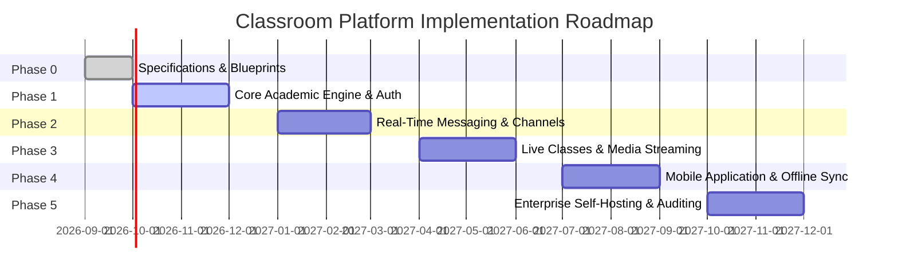

# Strategic Roadmap

This document outlines the planned multi-phase development progression of the **Classroom Platform**.

---

## 1. Roadmap Overview

---

## 2. Phase Breakdown

### Phase 0: Architectural Blueprints & Specifications (Current)
* **Goal**: Establish a unified, unambiguous architecture, directory structure, domain definitions, and API specifications.
* **Deliverables**:
  * Complete monorepo directory layout.
  * Comprehensive documentation across 10 modules under `docs/`.
  * Architectural Decision Records (ADRs 001 - 005).
  * Formal API and database contracts.

### Phase 1: Core Academic Engine & Authentication
* **Goal**: Build the foundational data models, security boundary, and core academic workflows.
* **Key Capabilities**:
  * Spring Boot scaffolding with PostgreSQL persistence.
  * Multi-factor authentication, JWT tokens, and institutional SSO integration.
  * Multi-tenancy for institutions, departments, and academic terms.
  * Classroom creation, roster enrollment, syllabi management.
  * Assignment authoring, rubric criteria, student submission pipelines, and gradebook scoring.
  * Next.js web application foundational shell and academic portal.

### Phase 2: Real-Time Messaging & Channels
* **Goal**: Deliver Discord-like persistent channels, rich chat, and real-time event distribution.
* **Key Capabilities**:
  * WebSocket real-time gateway backed by Redis Pub/Sub.
  * Categorized channels: Text, Voice, and Announcements.
  * Rich-text message rendering with Markdown and syntax highlighting.
  * Message threading, mentions, unread badges, and emoji reactions.
  * MinIO S3-compatible chunked file attachment uploads.

### Phase 3: Live Classes & Media Streaming
* **Goal**: Integrate WebRTC-based interactive classrooms and automated lecture recording.
* **Key Capabilities**:
  * LiveKit SFU server integration for low-latency audio/video communication.
  * Virtual stage channels with speaker moderation and "Raised Hand" queues.
  * Screen sharing, breakout rooms, and synchronized collaborative whiteboard.
  * LiveKit Egress automated recording pipeline saving MP4/HLS streams to MinIO.
  * Recording playback player with chapter markers and auto-generated transcripts.

### Phase 4: Mobile Application & Offline Capabilities
* **Goal**: Provide native mobile experience for students and educators on iOS and Android.
* **Key Capabilities**:
  * React Native / Expo cross-platform mobile client (`apps/mobile`).
  * Push notification infrastructure (APNs/FCM) for assignment deadlines and mentions.
  * Mobile document scanning and camera attachments for homework submissions.
  * Low-bandwidth audio-only mode for live lectures.
  * Offline caching for downloaded course materials and offline assignment viewing.

### Phase 5: Enterprise Governance, Self-Hosting & Hardening
* **Goal**: Deliver single-node and clustered self-hosting packages with institutional audit capabilities.
* **Key Capabilities**:
  * Production Docker Compose and Helm charts for self-hosted installations.
  * Automated backup, restore, and disaster recovery CLI tools.
  * Comprehensive audit logging and institutional compliance reporting (FERPA/GDPR).
  * Full-text global search indexing across messages, materials, and submissions.
