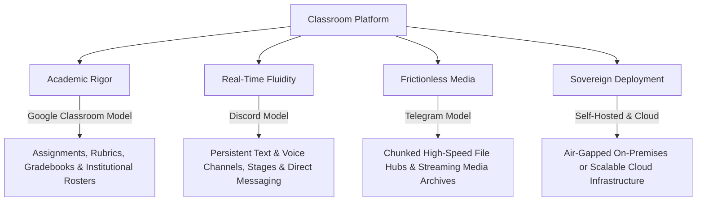

# Product Vision & Strategic Mission

## 1. Executive Summary

Educational technology today suffers from deep fragmentation. An educational institution typically relies on:
* A formal **Learning Management System (LMS)** (e.g., Google Classroom, Canvas, Blackboard) for course structures, assignment distribution, and grading.
* An informal **Chat Application** (e.g., Discord, Slack, WhatsApp) for real-time peer discussion, student-teacher questions, and club communication.
* A third-party **Video Conferencing Tool** (e.g., Zoom, Google Meet) for live lectures and office hours.
* A cloud **Storage or File Hub** (e.g., Google Drive, Telegram channels) for sharing heavy files, video recordings, and study notes.

This fragmented paradigm results in cognitive overload, missed homework deadlines, lost materials, privacy violations, and administrative blind spots.

**Classroom Platform** solves this by unifying academic rigor, real-time messaging, and interactive live classes into a single, cohesive, self-hostable platform.

---

## 2. Core Pillars

### Pillar 1: Academic Rigor (The Google Classroom Model)
Academic life requires structure. Courses must have syllabi, assignments need clear due dates, grading requires multi-dimensional rubrics, and institutions demand strict audit logs and gradebooks. Classroom Platform treats academic workflows as first-class citizens, ensuring that discussion never devolves into unstructured noise.

### Pillar 2: Real-Time Fluidity (The Discord Model)
Learning is inherently collaborative. Isolated assignment portals suppress engagement. Classroom Platform integrates real-time text channels, threaded peer inquiries, spontaneous audio study tables, and formal lecture stages directly into the classroom environment.

### Pillar 3: Frictionless Media Distribution (The Telegram Model)
Modern learning relies on large files: multi-gigabyte lab datasets, screen recordings, CAD diagrams, slide archives, and PDF textbooks. Classroom Platform implements high-speed, chunked, resumable uploads and streaming playback with no arbitrary, punitive file size limits.

### Pillar 4: Sovereign Deployment (Privacy & Self-Hosting)
Academic institutions handle sensitive student data, grades, and biometric video streams. Classroom Platform is architected from the ground up to support both hyperscale multi-tenant cloud hosting and fully autonomous, self-hosted, on-premises or air-gapped institutional deployments.

---

## 3. Success Metrics

1. **Engagement Velocity**: Increased frequency of student-instructor touchpoints per enrolled course.
2. **Context Retention**: Elimination of external link dependencies for video calls and file downloads.
3. **Turn-In Punctuality**: Reduced late assignment rates via synchronized push notifications and contextual channel reminders.
4. **Institutional Independence**: Complete operational autonomy for schools electing self-hosted deployment.
