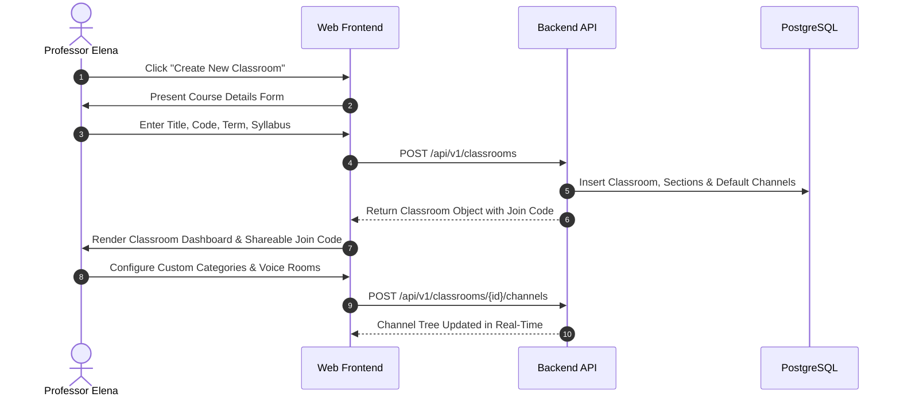
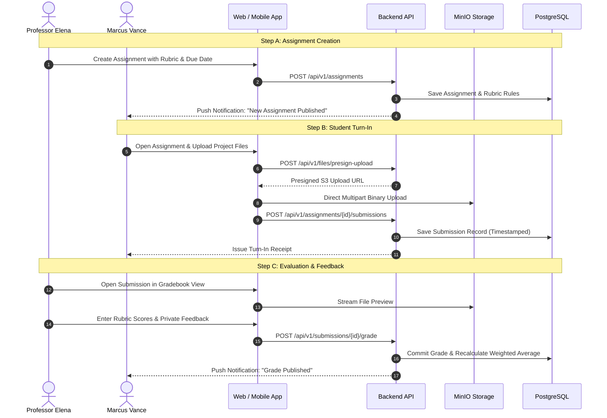
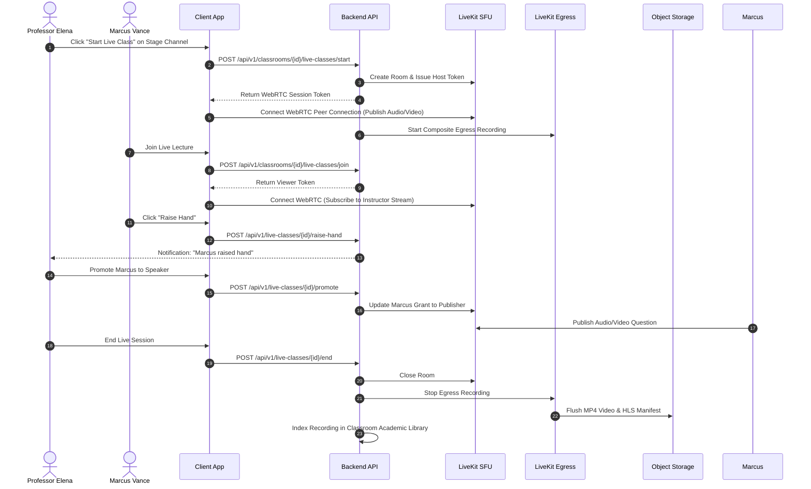

# Core User Flows

This document details the primary user journeys across the **Classroom Platform**, mapping user interactions across web and mobile interfaces.

---

## 1. Flow 1: Course Onboarding & Classroom Setup (Instructor)

---

## 2. Flow 2: Assignment Lifecycle (Publish, Submit, Grade)

---

## 3. Flow 3: Live Class Stage & Automated Recording

