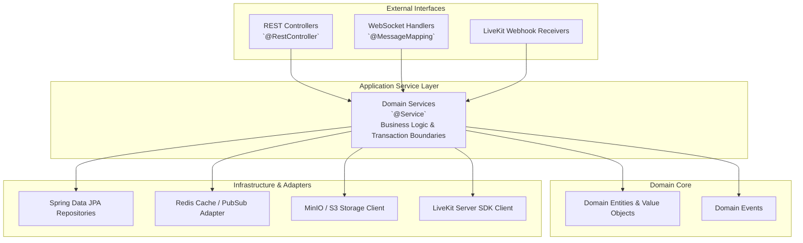

# Backend Architecture Specification

## 1. Overview & Framework Direction

The backend for Classroom Platform is proposed as an enterprise **Spring Boot** application, leveraging Java 21 LTS. This provides strong type safety, mature ecosystem tooling, battle-tested concurrency, and deep integration with relational data stores.

---

## 2. Layered Architecture Pattern

The backend follows a **Hexagonal / Clean Architecture** approach within domain packages to prevent tight coupling and preserve testability.

---

## 3. Domain Package Decomposition

Package Root: `com.classroom.platform`

| Sub-Package | Primary Responsibilities |
| :--- | :--- |
| `config` | Spring context configuration, OpenAPI setup, thread pool executors, WebMvc configs. |
| `security` | Spring Security filters, JWT authentication, RBAC/ABAC authorization annotations. |
| `auth` | Multi-factor authentication, OAuth2/OIDC/SAML token issuance, password resets. |
| `users` | User lifecycle, avatar management, presence synchronization, profile settings. |
| `institutions` | Multi-tenant organization boundaries, department setups, academic term configs. |
| `classrooms` | Course containers, syllabi bindings, section management, archive rules. |
| `channels` | Channel categories, text/voice/stage channel creation, channel-level permissions. |
| `messaging` | Real-time chat message persistence, Markdown sanitization, thread branching. |
| `files` | File asset metadata, presigned URL generation, virus scanning event handlers. |
| `assignments` | Assignment definitions, rubric criteria authoring, due date enforcement. |
| `submissions` | Student artifact reception, versioning, turn-in receipts, plagiarism hooks. |
| `grades` | Rubric scoring, gradebook calculations, private feedback loops, CSV exports. |
| `live` | LiveKit room provisioning, participant token generation, stage moderation. |
| `recordings` | Recording session tracking, chapter marking, streaming manifest generation. |
| `notifications` | Asynchronous notification dispatch via WebSocket, email, and mobile push. |
| `search` | Full-text query parsing and search index orchestration. |
| `administration` | Tenant governance, storage quota enforcement, platform telemetry. |
| `common` | Global error handlers (`@ControllerAdvice`), pagination wrappers, common DTOs. |
| `infrastructure` | Low-level drivers for PostgreSQL (JPA), Redis (Lettuce), MinIO (S3), LiveKit SDK. |

---

## 4. Concurrency & Transaction Management

1. **Transactional Boundaries**: Transaction boundaries (`@Transactional`) are enforced strictly at the Domain Service layer. Long-running I/O operations (file uploads, WebRTC calls) are executed outside database transactions.
2. **Virtual Threads (Project Loom)**: Evaluated to enable massive concurrency for blocking I/O calls without thread pool exhaustion.
3. **Asynchronous Events**: Internal domain events (e.g., `AssignmentPublishedEvent`, `GradeReleasedEvent`) are handled asynchronously via Spring Application Events backed by thread pools.
