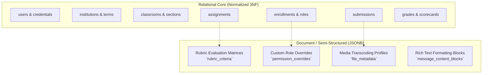

# Database Architecture Specification

## 1. Engine Selection & Technical Rationale

Classroom Platform adopts **PostgreSQL 16+** as its primary relational persistence engine. 

### Rationale
* **ACID Guarantees**: Absolute data integrity for grades, submissions, student records, and institutional audits.
* **Hybrid Relational & Document Model**: Rich support for structured relational tables combined with `JSONB` columns for variable rubric criteria, permission matrices, and rich-text message formatting.
* **Full-Text Search**: Built-in `tsvector` and GIN indexing for fast search across messages and course materials prior to introducing external search engines.

---

## 2. Relational vs. Document Strategy

* **Relational Schema**: Applied to all critical foreign-key relationships (user-to-classroom, classroom-to-channel, assignment-to-submission).
* **JSONB Schema**: Applied strictly to extensible entities where schema variance is high and normalization would create excessive join overhead (rubric level definitions, fine-grained permission flags).

---

## 3. Indexing & Partitioning Strategy

### 3.1 Primary & Composite Indexing
* All primary keys utilize randomly generated `UUIDv7` or `ULID` values to ensure chronological sortability without exposing sequential auto-increment identifiers.
* Foreign keys maintain explicit B-tree indexes.
* Frequently filtered composite paths (e.g., `(channel_id, created_at DESC)` for message feeds) have dedicated composite indexes.

### 3.2 Table Partitioning (Future High-Scale)
* **Message History (`messages`)**: Range-partitioned by `created_at` (monthly or quarterly) once message volumes exceed 10 million rows per tenant.
* **Audit Logs (`audit_logs`)**: Partitioned by calendar quarter for archiving and compliance pruning.

---

## 4. Connection Pooling & Scaling

* **Connection Pooler**: Managed via **HikariCP** on the Spring Boot application tier, with optional **PgBouncer** connection pooling in high-concurrency cloud environments.
* **Read Replicas**: Write queries target the primary PostgreSQL instance. Heavy analytical queries (e.g., semester-wide gradebook CSV exports, historical attendance reports) are routed to read replicas.
