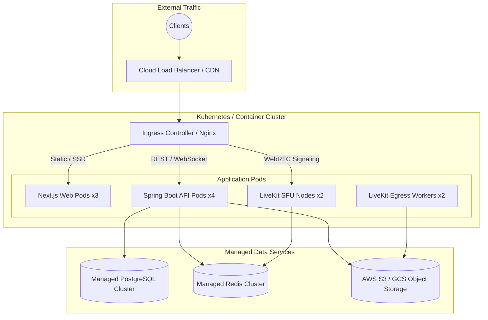

# Deployment Architecture Specification

## 1. Overview & Dual Deployment Targets

Classroom Platform is engineered to support two primary deployment topologies:
1. **Cloud-Native Clustered Deployment**: Horizontally scalable across cloud Kubernetes clusters or managed container services (AWS ECS, GCP Cloud Run) for large multi-tenant platforms.
2. **Self-Hosted Single-Node / On-Premises**: A streamlined, all-in-one containerized deployment running via Docker Compose on a single virtual private server (VPS) or institutional campus hardware.

---

## 2. Cloud-Native Clustered Topology



---

## 3. Self-Hosted Single-Node Topology

For private schools, research laboratories, or privacy-conscious institutions, Classroom Platform can run autonomously on a single dedicated host.

```mermaid
graph TD
    Client((Client Browser / Mobile)) --> HostRP[Nginx Gateway :443]

    subgraph "Single Dedicated Host (Docker Compose)"
        HostRP --> WebContainer[Next.js Container :3000]
        HostRP --> APIContainer[Spring Boot Container :8080]
        HostRP --> SFUContainer[LiveKit Container :7880]

        APIContainer --> LocalPG[(PostgreSQL Container :5432)]
        APIContainer --> LocalRedis[(Redis Container :6379)]
        APIContainer --> LocalMinIO[(MinIO Storage :9000)]
        SFUContainer --> LocalMinIO
    end

    subgraph "Persistent Host Volumes"
        LocalPG --- Vol1[/var/lib/classroom/postgres]
        LocalMinIO --- Vol2[/var/lib/classroom/minio]
        LocalRedis --- Vol3[/var/lib/classroom/redis]
    end
```

---

## 4. Minimum Hardware Sizing Guidelines

| Target Environment | Concurrent Users | CPU Cores | RAM | Storage |
| :--- | :--- | :--- | :--- | :--- |
| **Self-Hosted Small** (< 200 users) | 200 active / 25 live class | 4 vCPU | 8 GB | 100 GB NVMe |
| **Self-Hosted Medium** (< 1,000 users) | 1,000 active / 100 live class | 8 vCPU | 16 GB | 500 GB NVMe |
| **Cloud Clustered** (10,000+ users) | Clustered autoscale | 32+ vCPU total | 64+ GB total | Scalable S3 |
