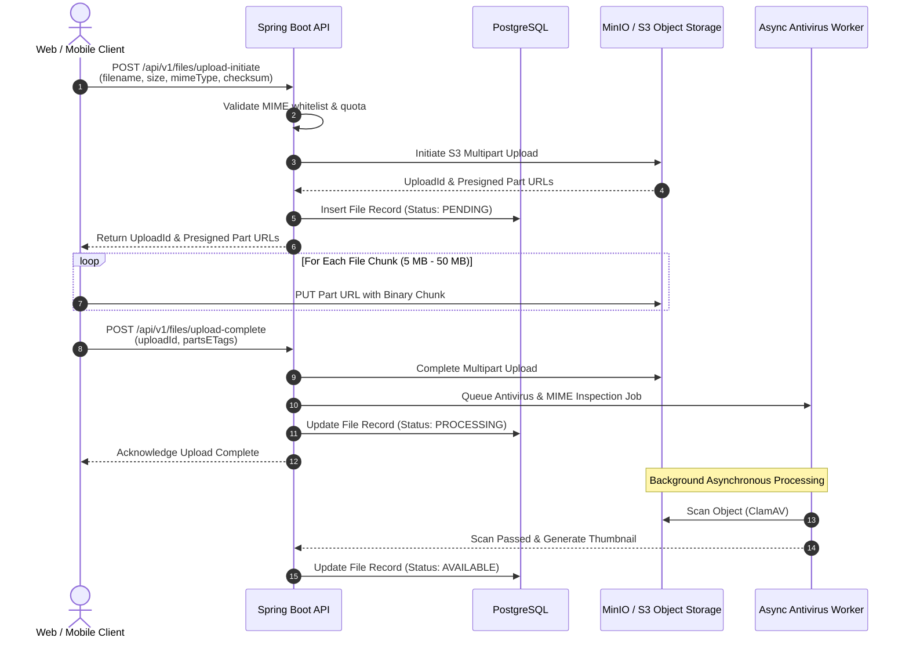

# File Storage & Media Architecture

## 1. Overview & High-Capacity Storage Philosophy

In academic environments, students and faculty frequently exchange large binary files: project ZIP archives, high-resolution microscope scans, multi-gigabyte virtual machine images, and raw video recordings.

Classroom Platform avoids routing file binaries through the application server memory. Instead, it utilizes **direct-to-storage presigned upload and download pipelines** backed by **MinIO** or **AWS S3-compatible object storage**.

---

## 2. Presigned Multipart Upload Pipeline

---

## 3. Storage Bucket Taxonomy

Storage is logically segregated into three distinct buckets to enforce security policies and lifecycle management:

| Bucket Name | Access Model | Content Type | Lifecycle Policy |
| :--- | :--- | :--- | :--- |
| `classroom-submissions` | Private (Presigned only) | Student homework turn-in artifacts | Immutable retention; locked after grading |
| `classroom-materials` | Institutional Private | Lecture slides, syllabi, course reading PDFs | Retained for course lifetime |
| `classroom-recordings` | Institutional Private | MP4 & HLS video streams from live lectures | Transcoded; auto-archived after 2 semesters |
| `classroom-public-assets` | Public Read | User avatars, course banner graphics | Cached globally via CDN |

---

## 4. File Security & Processing

1. **Direct Uploads**: Clients never push large binaries directly through Spring Boot HTTP threads, preventing JVM heap memory exhaustion.
2. **Virus & Malware Scanning**: Newly uploaded files remain in `PENDING_SCAN` state until an asynchronous worker scans the object with ClamAV. Infected files are quarantined and purged immediately.
3. **Magic Byte Inspection**: Content type validation is performed on the first 512 bytes of the uploaded file to prevent executable files masked with benign extensions (e.g., `.exe` disguised as `.pdf`).
