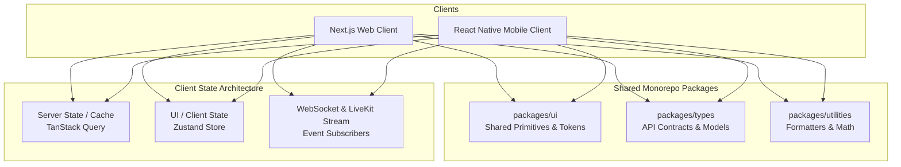

# Frontend Architecture Specification

## 1. Overview & Dual-Client Strategy

Classroom Platform adopts a unified client architecture delivering specialized experiences across two primary form factors:
* **Web Application (`apps/web`)**: Implemented via **Next.js** (App Router), optimized for desktop productivity, dense gradebook tables, dual-pane live classroom moderation, and multi-file review.
* **Mobile Application (`apps/mobile`)**: Implemented via **React Native** and **Expo**, optimized for fast on-the-go notifications, live class audio attendance, quick chat replies, and camera-based document turn-in.

Both frontends share design tokens, API types, and business utilities from the `packages/` workspace.

---

## 2. Frontend Component & Layering Model

---

## 3. Web Architecture (`apps/web`)

### 3.1 App Router & Layout Structure
* **Root Layout**: Provides global theme providers (Dark/Light mode), authentication context, and WebSocket connection listeners.
* **Institutional Layout (`/institution/[tenantId]`)**: Handles tenant-level branding, institution navigation, and term selector.
* **Classroom Layout (`/classrooms/[classId]`)**: Implements the dual-pane workspace:
  * Left sidebar: Channel tree, categories, voice room participants.
  * Main view: Active channel feed, assignment list, or live class stage.
  * Right drawer (collapsible): Active thread, member presence list, or assignment rubric panel.

### 3.2 Server vs. Client Component Boundaries
* **Server Components (RSC)**: Syllabi views, public course pages, initial gradebook loads.
* **Client Components (`"use client"`)**: Real-time chat message lists, interactive rubric scoring grids, LiveKit WebRTC video rooms, rich-text editors.

---

## 4. Mobile Architecture (`apps/mobile`)

### 4.1 Native Mobile Capabilities
* **Camera Integration**: Native document scanner for snapping physical homework pages and uploading as multi-page PDFs.
* **Background Audio**: Keeps live lecture audio connected when students lock their screen or switch applications.
* **Push Notifications**: Deep-linking directly to specific channels, messages, or assignments on receipt of APNs/FCM pushes.

---

## 5. State Management & Data Synchronization

1. **Server State (`TanStack Query`)**: Manages caching, optimistic updates, pagination, and invalidation for all REST API endpoints.
2. **Client State (`Zustand`)**: Manages transient UI state such as audio device selection, sidebar collapse states, and draft message text.
3. **Real-time Synchronization**: Incoming WebSocket events immediately mutate the TanStack Query cache, ensuring instant UI updates without manual re-fetching.
