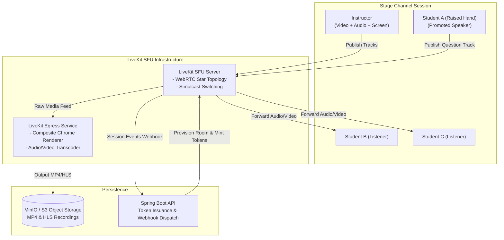

# Live Class & Media Streaming Architecture

## 1. Overview & Technology Direction

The live classroom subsystem powers real-time lectures, seminars, office hours, and study breakout rooms. It is proposed to leverage **LiveKit**, an open-source, WebRTC-based Selective Forwarding Unit (SFU).

### Key Capabilities
* Ultra-low latency audio/video streaming (< 300 ms glass-to-glass).
* Dynamic simulcast: Automatically adjusts video quality based on each student's network constraints.
* Hierarchical stage permissions: Instructors as broadcasters, students as listeners, with "Raised Hand" promotion.
* Automated lecture recording via headless composite containers (LiveKit Egress).

---

## 2. Live Lecture & Stage Topology

---

## 3. Stage Moderation & Participation Controls

### 3.1 Role Grants in WebRTC Tokens
Access to LiveKit rooms is governed by cryptographically signed JWT tokens issued by the Spring Boot API:
* **Host / Co-Host (Instructor / TA)**: Granted `canPublish: true`, `canPublishData: true`, `canSubscribe: true`, `roomAdmin: true`.
* **Participant (Student)**: Default token granted `canPublish: false`, `canSubscribe: true`.
* **Promoted Speaker (Student with Raised Hand)**: Token updated via server-side API call to grant temporary `canPublish: true`.

### 3.2 Breakout Rooms
* The instructor can spawn transient breakout rooms (e.g., `room:lecture-101:breakout-1`).
* Students are reassigned to their assigned breakout rooms via WebSocket commands.
* Audio/video tracks are detached from the main stage and attached to the breakout mesh.
* A global broadcast channel allows the instructor to send text/audio announcements to all breakout rooms simultaneously.

---

## 4. Automated Recording Pipeline (LiveKit Egress)

1. **Trigger**: The instructor starts a lecture with recording enabled (or policy auto-records).
2. **Egress Dispatch**: Spring Boot issues an Egress command to the LiveKit Egress service specifying room ID, layout template, and S3 destination bucket.
3. **Composite Rendering**: Egress spins up a headless Chromium container, renders the stage (speaker video + shared screen + whiteboard), and pipes the stream into FFmpeg.
4. **Storage & Archival**: FFmpeg writes high-definition MP4 files and multi-bitrate HLS segments directly to MinIO.
5. **Completion Webhook**: Egress notifies Spring Boot upon completion. The API indexes the recording under the classroom's Academic Library.
