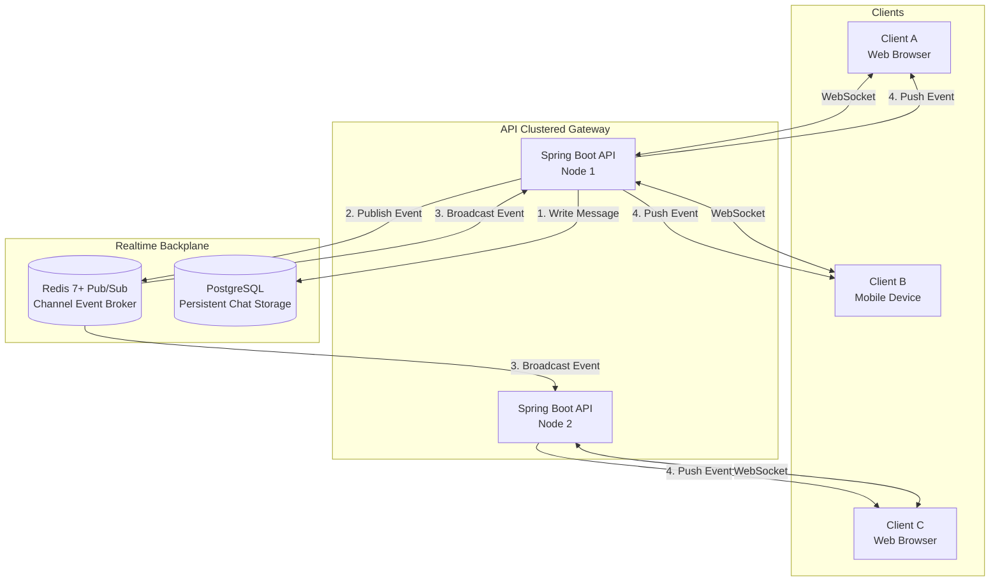

# Real-Time & Messaging Architecture

## 1. Overview & Architectural Goals

The real-time subsystem powers low-latency communications across the Classroom Platform:
* Persistent channel chat and threaded replies (< 100 ms delivery latency).
* Instant typing indicators and emoji reaction sync.
* Real-time user presence tracking (`Online`, `Idle`, `In Class`, `Offline`).
* Live notifications for urgent announcements, assignment due date alerts, and grades.

---

## 2. Real-Time Topology & Redis Backplane

To allow horizontal scaling across multiple Spring Boot API instances, client WebSocket connections are decoupled from message dispatch using a **Redis Pub/Sub** distributed backplane.

---

## 3. WebSocket Connection Lifecycle

1. **Handshake & Authentication**:
   * Client initiates HTTP Upgrade to WebSocket (`/ws/connect`).
   * Authentication token (`Bearer JWT`) is passed via connection query param or initial STOMP `CONNECT` frame.
   * Server validates token, extracts `userId` and `tenantId`, and registers the session.
2. **Channel Subscriptions**:
   * Client issues subscription requests: `/topic/channel.{channelId}` or `/user/queue/notifications`.
   * Server validates whether the user is an enrolled member with read permissions for `channelId`.
3. **Heartbeats & Presence**:
   * Client sends ping frames every 30 seconds.
   * Ephemeral user presence is updated in Redis via `SET presence:{userId} "ONLINE" EX 60`.
4. **Disconnection & Reconnection**:
   * On disconnect, if no ping is received within 60 seconds, presence transitions to `OFFLINE`.
   * Clients implement exponential backoff reconnection and replay missed messages via `lastReadMessageId`.

---

## 4. Message Ordering & Delivery Guarantees

* **Ordering**: Every message in a channel receives a monotonically increasing snowflake/ULID identifier generated at database insert time. Clients render messages strictly by this identifier.
* **At-Least-Once Delivery**: The client displays optimistic messages immediately, reconciling them with the server-acknowledged ID. If a WebSocket disconnects, the client queries `/api/v1/channels/{id}/messages?since={lastId}` upon reconnect.
