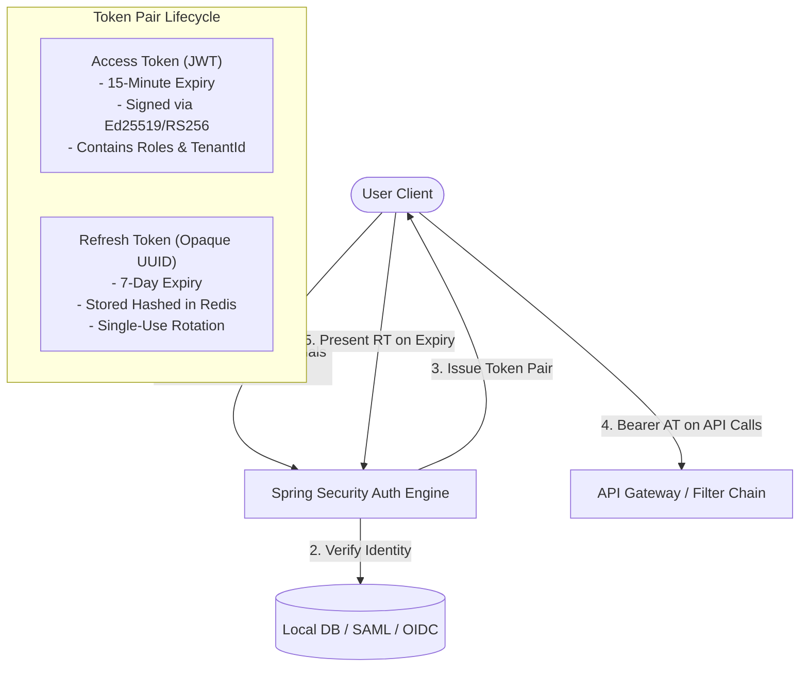

# Security Architecture & Threat Model

## 1. Security Philosophy & Principles

The Classroom Platform handles sensitive student educational records, faculty evaluations, and private classroom communications. Security controls adhere to the following principles:
* **Zero-Trust Network Model**: All internal traffic between edge proxies, services, and databases is authenticated and encrypted.
* **Defense-in-Depth**: Multiple layers of validation (API gateway rate limiting, Spring Security filters, database row-level isolation).
* **Least Privilege**: Users are granted only the minimum permissions necessary for their academic role.

---

## 2. Authentication & Token Architecture

---

## 3. Authorization Architecture: RBAC & ABAC

Authorization is enforced using a hybrid model:
1. **Role-Based Access Control (RBAC)**: Coarse-grained roles (`SUPER_ADMIN`, `INSTITUTION_ADMIN`, `TEACHER`, `TEACHING_ASSISTANT`, `STUDENT`) govern access to broad controller endpoints.
2. **Attribute-Based Access Control (ABAC)**: Context-dependent permissions evaluate entity attributes at runtime:
   * *Example*: A user with role `STUDENT` may execute `GET /submissions/{id}` **only if** `submission.student_id == current_user.id`.
   * *Example*: A user with role `TEACHER` may execute `POST /grades` **only if** they are an assigned instructor for the classroom owning the assignment.

---

## 4. Multi-Tenant Data Isolation

* Every core database table includes an indexed `institution_id` column.
* Spring Data JPA entity listeners and Hibernate filters automatically append `WHERE institution_id = :currentTenantId` to all select queries for multi-tenant users.
* Cross-institution data leakage is structurally prevented at the persistence tier.

---

## 5. Encryption & Data Protection Standards

| Layer | Standard | Details |
| :--- | :--- | :--- |
| **Data in Transit** | TLS 1.3 | Enforced on edge proxies; legacy TLS < 1.2 disabled. |
| **Media Streams** | DTLS-SRTP | WebRTC audio/video streams encrypted point-to-point. |
| **Data at Rest** | AES-256 | Transparent Data Encryption (TDE) on PostgreSQL and S3 volumes. |
| **Credential Storage** | Argon2id / BCrypt | Salted and hashed passwords with cost factor 12. |
| **Tokens** | RS256 / Ed25519 | Cryptographically signed asymmetric JWT tokens. |
