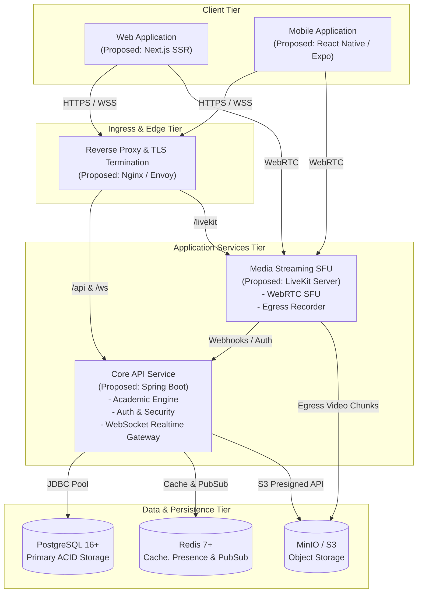

# High-Level System Architecture

## 1. Architectural Philosophy

The Classroom Platform is designed as a **modular, domain-driven distributed system**. It strictly decouples latency-sensitive media pipelines (WebRTC live streams and WebSocket real-time feeds) from transactional academic workflows (assignments, submissions, grading, and roster management).

---

## 2. Tiered System Topology

---

## 3. Subsystem Breakdown

### 3.1 Ingress & Edge Proxy
* **Role**: Single entrypoint for all HTTP, WebSocket, and WebRTC signaling traffic.
* **Responsibilities**:
  * SSL/TLS termination with modern cipher suites.
  * Ingress routing: `/api/*` and `/ws/*` routed to Spring Boot; `/livekit/*` routed to LiveKit SFU; all other requests routed to Next.js.
  * Basic DDoS mitigation, rate limiting, and HTTP security header injection.

### 3.2 Core Backend API Service (Proposed: Spring Boot)
* **Role**: Primary orchestrator of business logic, security policies, and transactional integrity.
* **Key Components**:
  * **Academic Management Module**: Courses, syllabi, rosters, assignments, and rubric grading.
  * **Community & Channel Module**: Category management, channel permissions, message persistence.
  * **Realtime WebSocket Server**: Ephemeral client connection handling and event broadcasting.
  * **Security & Auth Module**: OAuth2/OIDC/SAML integration, JWT minting, RBAC/ABAC enforcement.

### 3.3 Media Streaming SFU (Proposed: LiveKit)
* **Role**: Selective Forwarding Unit for low-latency WebRTC audio, video, and screen sharing.
* **Key Components**:
  * **LiveKit Server**: WebRTC mesh-to-star forwarding, simulcast track switching, bandwidth adaptation.
  * **LiveKit Egress**: Headless composite rendering of live lectures to MP4 files and HLS playlists.

### 3.4 Data & Persistence Tier
* **PostgreSQL**: Relational database storing users, institutions, classrooms, assignments, submissions, grades, and channel histories.
* **Redis**: In-memory data store for active sessions, user presence, rate limiting counters, and Pub/Sub event distribution across API instances.
* **MinIO / S3**: Object storage for homework submissions, course syllabus attachments, avatars, and recorded video archives.
