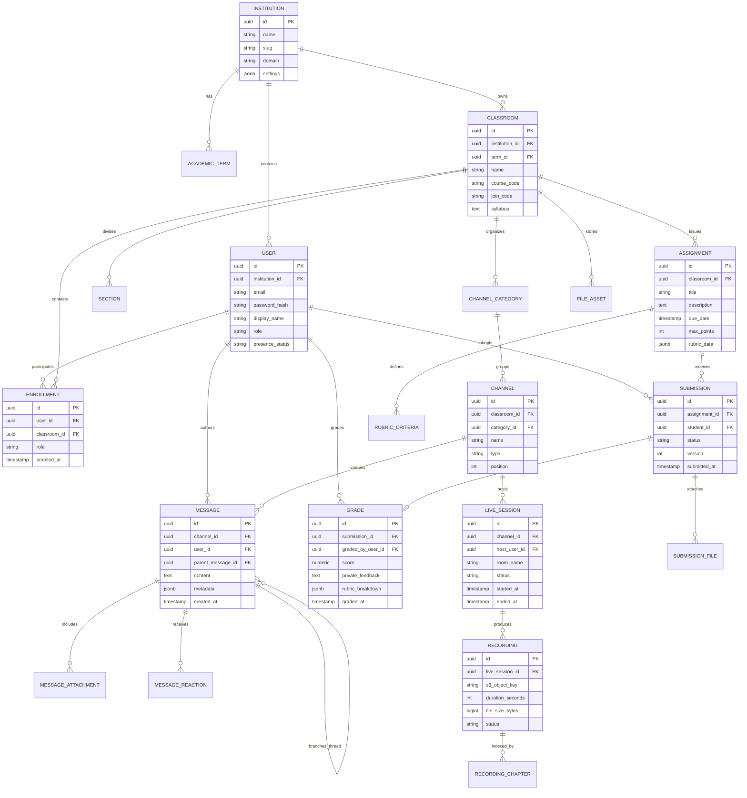

# Entity-Relationship (ER) Diagram

This document models the conceptual and logical entity relationships across the Classroom Platform database.

---

## 1. Complete Entity-Relationship Diagram

```mermaid
erDiagram
    INSTITUTION ||--o{ ACADEMIC_TERM : has
    INSTITUTION ||--o{ USER : contains
    INSTITUTION ||--o{ CLASSROOM : owns

    USER ||--o{ ENROLLMENT : participates
    USER ||--o{ MESSAGE : authors
    USER ||--o{ SUBMISSION : submits
    USER ||--o{ GRADE : grades

    CLASSROOM ||--o{ SECTION : divides
    CLASSROOM ||--o{ ENROLLMENT : contains
    CLASSROOM ||--o{ CHANNEL_CATEGORY : organizes
    CLASSROOM ||--o{ ASSIGNMENT : issues
    CLASSROOM ||--o{ FILE_ASSET : stores

    CHANNEL_CATEGORY ||--o{ CHANNEL : groups
    CHANNEL ||--o{ MESSAGE : contains
    CHANNEL ||--o{ LIVE_SESSION : hosts

    MESSAGE ||--o{ MESSAGE_ATTACHMENT : includes
    MESSAGE ||--o{ MESSAGE_REACTION : receives
    MESSAGE ||--o{ MESSAGE : branches_thread

    ASSIGNMENT ||--o{ SUBMISSION : receives
    ASSIGNMENT ||--o{ RUBRIC_CRITERIA : defines

    SUBMISSION ||--o{ SUBMISSION_FILE : attaches
    SUBMISSION ||--o| GRADE : evaluated_by

    LIVE_SESSION ||--o{ RECORDING : produces
    RECORDING ||--o{ RECORDING_CHAPTER : indexed_by

    INSTITUTION {
        uuid id PK
        string name
        string slug
        string domain
        jsonb settings
    }

    USER {
        uuid id PK
        uuid institution_id FK
        string email
        string password_hash
        string display_name
        string role
        string presence_status
    }

    CLASSROOM {
        uuid id PK
        uuid institution_id FK
        uuid term_id FK
        string name
        string course_code
        string join_code
        text syllabus
    }

    ENROLLMENT {
        uuid id PK
        uuid user_id FK
        uuid classroom_id FK
        string role
        timestamp enrolled_at
    }

    CHANNEL {
        uuid id PK
        uuid classroom_id FK
        uuid category_id FK
        string name
        string type
        int position
    }

    MESSAGE {
        uuid id PK
        uuid channel_id FK
        uuid user_id FK
        uuid parent_message_id FK
        text content
        jsonb metadata
        timestamp created_at
    }

    ASSIGNMENT {
        uuid id PK
        uuid classroom_id FK
        string title
        text description
        timestamp due_date
        int max_points
        jsonb rubric_data
    }

    SUBMISSION {
        uuid id PK
        uuid assignment_id FK
        uuid student_id FK
        string status
        int version
        timestamp submitted_at
    }

    GRADE {
        uuid id PK
        uuid submission_id FK
        uuid graded_by_user_id FK
        numeric score
        text private_feedback
        jsonb rubric_breakdown
        timestamp graded_at
    }

    LIVE_SESSION {
        uuid id PK
        uuid channel_id FK
        uuid host_user_id FK
        string room_name
        string status
        timestamp started_at
        timestamp ended_at
    }

    RECORDING {
        uuid id PK
        uuid live_session_id FK
        string s3_object_key
        int duration_seconds
        bigint file_size_bytes
        string status
    }
```
