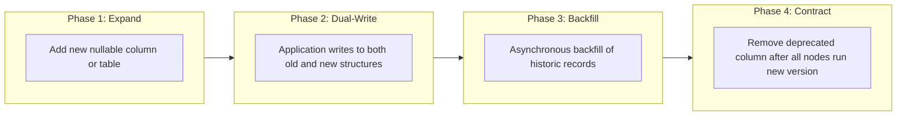

# Database Migrations & Evolution Strategy

## 1. Migration Framework Direction

Classroom Platform uses **Flyway** (or Liquibase) embedded within the Spring Boot application lifecycle to manage schema evolution.

### Core Principles
1. **Idempotence & Immutability**: Applied migration scripts are never modified. Any fix or alteration must be applied as a new versioned migration.
2. **Versioned Naming Convention**:
   ```text
   V<Major>_<Minor>_<Patch>__<description>.sql
   Example: V1_0_0__initial_schema_setup.sql
   Example: V1_0_1__add_assignment_lock_date.sql
   ```
3. **Repeatable Migrations**: Stored procedures, triggers, and views are managed via repeatable migrations:
   ```text
   R__update_gradebook_summary_view.sql
   ```

---

## 2. Zero-Downtime Migration Policy (Expand-Contract)

To ensure high availability and prevent downtime during continuous deployments, schema changes follow the **Expand/Contract Pattern**:



### Prohibited Operations in Single-Phase Migrations
* **Renaming Columns**: Never rename a column directly (`ALTER TABLE ... RENAME`). Instead, add the new column, dual-write, backfill, and drop the old column in a subsequent release.
* **Adding Non-Nullable Columns Without Defaults**: Always add new columns as `NULL` or provide an explicit default value to prevent locking production tables.
* **Blocking Index Creation**: Index additions in PostgreSQL must be executed with `CREATE INDEX CONCURRENTLY` in maintenance migrations.
