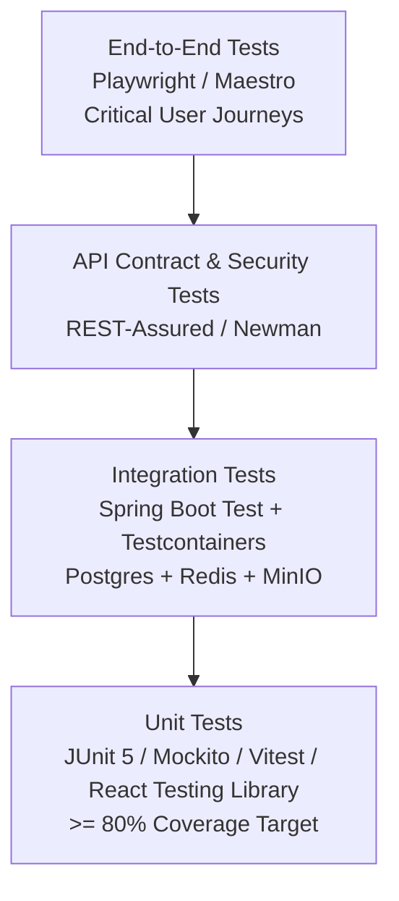

# System Testing Strategy

## 1. The Testing Pyramid

The testing strategy for Classroom Platform enforces comprehensive automated quality verification across multiple granularities.

---

## 2. Test Granularities

### 2.1 Unit Testing (Fast & Isolated)
* **Backend**: JUnit 5, AssertJ, and Mockito. Every domain service, rubric calculator, and validator must have dedicated unit tests with 100% branch coverage on business logic.
* **Frontend**: Vitest and React Testing Library. Component unit tests verify rendering, accessibility attributes, user interactions, and state mutations in isolation.

### 2.2 Integration Testing (Testcontainers)
* Integration tests run against ephemeral real container instances via **Testcontainers** (PostgreSQL, Redis, MinIO).
* H2 in-memory databases are strictly forbidden because they fail to test PostgreSQL-specific features (JSONB operators, UUIDv7, full-text search).

### 2.3 API & Contract Testing
* Verify that REST endpoints strictly adhere to OpenAPI specifications.
* Negative security testing: Every endpoint is validated with missing tokens, expired tokens, and cross-tenant unauthorized IDs to guarantee `401 Unauthorized` and `403 Forbidden` responses.

### 2.4 End-to-End Testing (E2E)
* **Web**: Playwright tests covering end-to-end user journeys (Teacher creates assignment -> Student submits homework -> Teacher grades rubric -> Student views scorecard).
* **Mobile**: Maestro or Detox tests verifying authentication, channel navigation, and offline behavior.

### 2.5 Realtime & WebRTC Load Testing
* k6 load-testing scripts simulate 1,000+ concurrent WebSocket connections sending messages and presence updates.
* LiveKit synthetic load-testing agents simulate 100+ concurrent WebRTC audio/video subscribers in a stage room to measure packet loss, jitter, and SFU CPU utilization.
