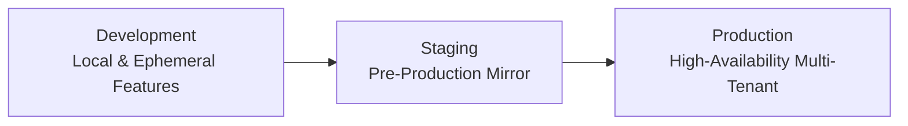

# Environment Strategy & Configuration Matrix

## 1. Environment Topology

The platform defines three formal deployment targets to ensure that code is validated systematically before reaching production:

---

## 2. Configuration & Parameter Matrix

| Parameter / Capability | Development (Local) | Staging | Production |
| :--- | :--- | :--- | :--- |
| **API Host** | `localhost:8080` | `api.staging.classroom.domain` | `api.classroom.domain` |
| **Web Host** | `localhost:3000` | `staging.classroom.domain` | `classroom.domain` |
| **Database** | Single Docker PostgreSQL | Managed PostgreSQL RDS | Multi-AZ Aurora PostgreSQL |
| **Redis** | Standalone Redis container | Managed Redis with Replica | Redis Clustered Multi-AZ |
| **Storage** | Local MinIO Container | S3 Bucket (staging-data) | Encrypted S3 Bucket (prod-data) |
| **LiveKit SFU** | Local Docker LiveKit | Single-Node Cloud LiveKit | Clustered LiveKit SFU Array |
| **SSL / TLS** | Self-signed / HTTP | Let's Encrypt Wildcard | Commercial TLS 1.3 / Cloudflare |
| **Log Level** | `DEBUG` | `INFO` | `WARN` / `INFO` (JSON) |
| **Email Delivery** | Local MailHog mock | Sandboxed SendGrid / Mailgun | Production SES / SendGrid |
| **Error Details in API** | Included in response | Stack traces suppressed | Clean RFC 7807 error codes |
