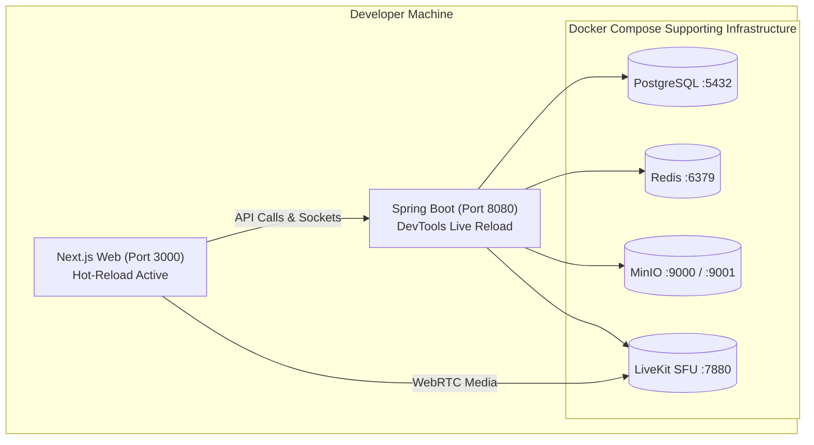

# Local Development Architecture & Workflow

## 1. Overview & Tooling Blueprint

The local development environment is designed to mirror production topology while minimizing local developer machine resource consumption.

### Tooling Prerequisites (Future Implementation)
* **Java Development Kit**: JDK 21 LTS (e.g., Eclipse Temurin).
* **Node.js**: Node 20 LTS or Node 22 LTS with `pnpm` or `npm`.
* **Container Runtime**: Docker Desktop or OrbStack / Colima.
* **Database Client**: Any PostgreSQL-compatible client (DBeaver, TablePlus, `psql`).

---

## 2. Local Port Allocations Blueprint

When running locally, platform components bind to standardized local ports to avoid collision:

| Service / Component | Port | Protocol | Description |
| :--- | :---: | :--- | :--- |
| **Next.js Web Frontend** | `3000` | HTTP | Local developer web application |
| **Spring Boot API Service** | `8080` | HTTP / WS | Core application API and WebSocket server |
| **PostgreSQL Database** | `5432` | TCP | Relational database instance |
| **Redis Cache** | `6379` | TCP | Real-time cache & Pub/Sub backplane |
| **MinIO S3 Storage API** | `9000` | HTTP (S3) | Object storage API endpoint |
| **MinIO Console** | `9001` | HTTP | Web UI for inspecting buckets and files |
| **LiveKit SFU Server** | `7880` | HTTP / WS | WebRTC signaling server |
| **LiveKit WebRTC Media** | `50000-50100`| UDP | Media streaming audio/video channels |

---

## 3. Developer Service Topology

