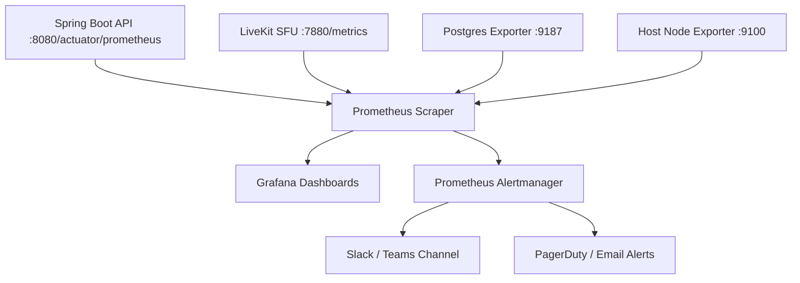

# Monitoring & Observability Runbook

## 1. Monitoring Topology

The platform integrates standard Prometheus and Grafana instances to monitor server health, user activity, database connection pools, and WebRTC streaming quality.

---

## 2. Key Dashboards

1. **Academic API Overview**:
   * Request rates (RPS), error rates (4xx, 5xx), p95 latency by endpoint.
   * Active WebSocket client count and message distribution throughput.
2. **Database & Cache Health**:
   * PostgreSQL active vs. idle connections in HikariCP pool.
   * Transaction commit/rollback rates and disk space consumption.
   * Redis memory usage, cache hit ratio, and connected Pub/Sub subscribers.
3. **Live Classroom & Streaming**:
   * Active live rooms, total participant count, speaker video bitrate.
   * Packet loss percentage, audio jitter, and active Egress recording pipelines.

---

## 3. Critical Alert Runbooks

* **High Database Connection Utilization (> 85%)**:
  * Action: Inspect slow queries in PostgreSQL `pg_stat_activity`; increase HikariCP maximum pool size if hardware resources permit.
* **Elevated API Error Rate (> 2% 5xx errors for 3 minutes)**:
  * Action: Inspect structured JSON logs in Loki/OpenSearch filtering by `level: ERROR`; check database and Redis connectivity.
* **Storage Volume Space Low (< 15% remaining)**:
  * Action: Trigger `scripts/maintenance/` orphan sweep; provision additional block storage volume capacity for MinIO.
