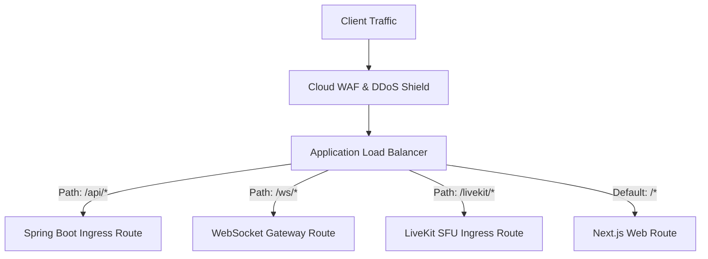

# Production Deployment Runbook

## 1. High-Availability Production Architecture

In production, the platform runs in a multi-availability-zone (Multi-AZ) cloud environment designed to eliminate single points of failure.

### Scalability Principles
* **Stateless Application Tiers**: Next.js web frontend pods and Spring Boot API pods are completely stateless.
* **Autoscaling Triggers**: Pods autoscale based on CPU utilization (> 70%) and active HTTP/WebSocket request rates.
* **Sticky Sessions**: Not required for HTTP or WebSockets, as connection states are persisted in Redis.

---

## 2. Ingress & Traffic Management

* **Zero-Downtime Deployments**: Executed using **Rolling Updates** or **Blue-Green Deployments** with pre-stop lifecycle hooks and readiness probe validation.
* **TLS Termination**: Enforces TLS 1.3 with automated certificate renewal via ACME / Let's Encrypt or AWS Certificate Manager.

---

## 3. Production Readiness Checklist

Before promoting any build to production:
- [ ] Database migrations executed and verified using expand-contract patterns.
- [ ] Redis cluster memory eviction policy set to `volatile-lru`.
- [ ] MinIO / S3 buckets configured with default AES-256 encryption.
- [ ] LiveKit SFU configured with appropriate TURN/STUN credentials.
- [ ] Rate limits configured at the reverse proxy (100 req/sec per IP burst limit).
- [ ] Prometheus alerting channels (Slack/PagerDuty) verified.
