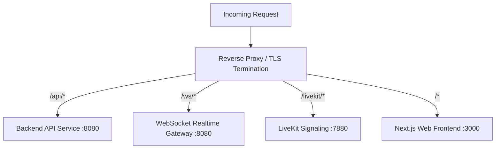

# Reverse Proxy & Edge Routing (`infrastructure/reverse-proxy/`)

## 1. Purpose of the Directory
`infrastructure/reverse-proxy/` contains routing blueprints, edge load balancing parameters, and TLS termination models for the Classroom Platform ingress gateway (proposed: Nginx or Envoy).

## 2. Ingress Routing Topology (Proposed)

## 3. What Belongs Here
* Edge routing blueprints, HTTP header forwarding (`X-Forwarded-For`, `X-Forwarded-Proto`).
* WebSocket upgrade directives (`Connection: upgrade`).
* Rate limiting zones, security headers (CSP, HSTS, X-Frame-Options), and TLS ciphersuite specifications.

## 4. What Does NOT Belong Here
* Live private SSL keys or certificates.
* Application routing controllers (belongs in `backend/` or `apps/web/`).
